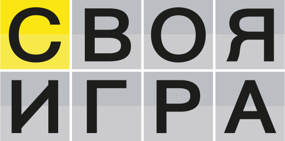

<h1 align="center">Браузерный интерфейс для проведения квиза по мотивам ТВ-передачи «Своя Игра»</h1>

<a href='https://azemcov.github.io/quiz_Svoya_Igra'>👉👉 ОТКРЫТЬ 👈👈</a>

## 📖 Описание
Билд интерфейса для проведения квиза использующий в качестве основы стилистику некогда популярной ТВ-передачи «Своя Игра». Управление как с помощью мышки так и с помощью клавиатуры для большего погружения в антураж передачи. Правила оригинальной передачи реализованы осознанно лишь частично, для упрощения проведения данного квиза в кампаниях «на веселе». Присутствуют стандартые вопросы (текстовые, аудио, фото) и вопрос «кот в мешке», предполагающий вопрос не по теме с рандомной сложностью, с возможностью передачи его выбравшей командой (игоком) другой команде.
 
[Правила оригинальной игры на fandom.com](https://chgk.fandom.com/wiki/Своя_игра)
 
Вопросы в react-приложении задаются через файл data.js, однако есть возможность сделать это в билде через интерфейс редактирования вопросов, с последующей воможностью совханения в виде json файла, а так же подгрузки ранее сохранённых json фалов с вопросами. Сохранение на сервер файлов не реализовано, поэтому картинки и аудио должны иметь прямые ссылки. (можно воспользоваться [wiki](www.wikipedia.org) или [dropbox](www.dropbox.com))
 

## 🔥 Обновления 
- **`Июль 8, 2024`**: Реализован редактор вопросов
- **`Июнь 29, 2024`**: Реализована основная логика приложения

## ⚙️ Использованные технологии

<a href="https://developer.mozilla.org/en-US/docs/Web/JavaScript">  </img> </a>
<a href="https://www.typescriptlang.org/"> </img></a>
<a href="https://react.dev/"> </img></a>
<a href="https://html.spec.whatwg.org/multipage/"> </img></a>
<a href="https://www.w3.org/Style/CSS/Overview.en.html"> </img></a>
<a href="https://getbootstrap.com/"> </img></a>

